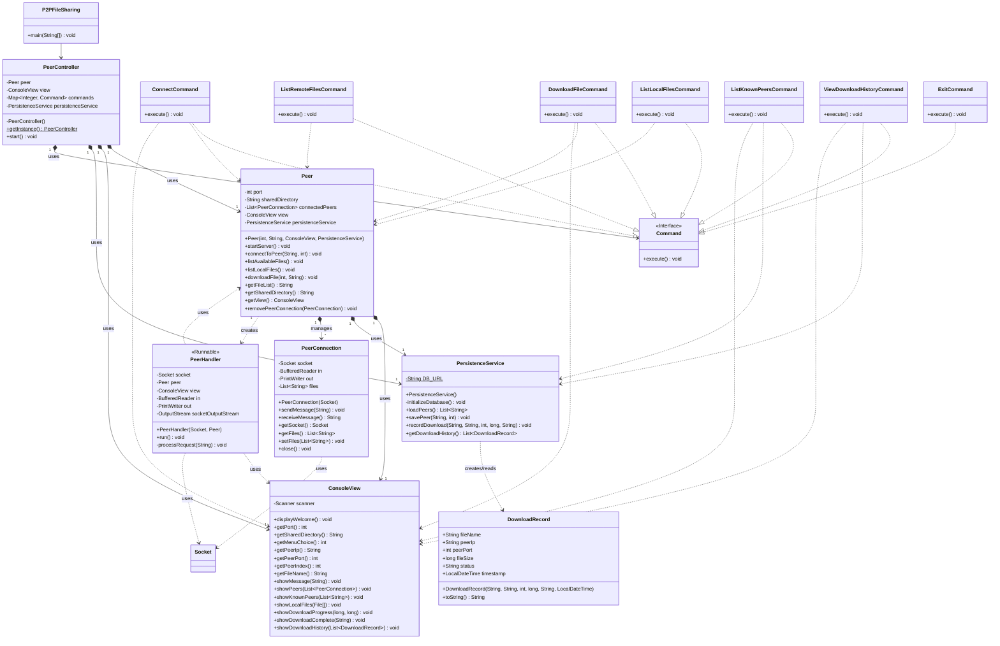

# UE22CS352B - Object Oriented Analysis & Design

## Mini Project Report

**Title: Peer-to-Peer (P2P) File Sharing Application**

**Submitted by:**

*   Name : SRN (Team Member 1)
*   Name : SRN (Team Member 2)
*   Name : SRN (Team Member 3)
*   Name : SRN (Team Member 4)

**[Semester]** **[Section]**

**[Faculty Name]**

**January - May 2025**

**DEPARTMENT OF COMPUTER SCIENCE AND ENGINEERING**
**FACULTY OF ENGINEERING**
**PES UNIVERSITY**
**(Established under Karnataka Act No. 16 of 2013) 100ft Ring Road, Bengaluru – 560 085, Karnataka, India**

---

## Problem Statement:

Traditional client-server file sharing relies on a central server, creating a single point of failure and potential bottlenecks. If the central server goes down, the entire sharing capability is lost. Furthermore, scaling such systems can be expensive. Peer-to-Peer (P2P) networks offer a decentralized alternative where individual computers (peers) connect directly to share resources.

This project aims to develop a simple command-line P2P file sharing application in Java. The application allows users to designate a directory on their computer for sharing files, connect to other peers on the network, browse the files shared by connected peers, and download desired files directly from them. The system should handle multiple connections simultaneously and persist information about known peers and download history for better usability across sessions.

## Key Features:

*   **Peer Initialization:** Start the application as a peer, specifying a port for listening and a directory for sharing files.
*   **Peer Discovery & Connection:** Manually connect to other peers by providing their IP address and port number.
*   **File Listing (Remote):** View the list of files shared by currently connected peers.
*   **File Listing (Local):** View the list of files available in the local shared directory.
*   **File Download:** Download a specific file from a connected peer. Includes progress indication.
*   **Persistence:** Store information about successfully connected peers (IP/Port) in a local SQLite database (`p2p_data.db`) to facilitate future connections.
*   **Download History:** Record details of completed and failed downloads (file name, peer, size, status, timestamp) in the SQLite database.
*   **Concurrency:** Handle multiple incoming peer connections simultaneously using Java Threads (`PeerHandler`).
*   **Command-Line Interface:** Interact with the application through a simple text-based menu.

---

## Models:

**(Note: Insert your actual created UML diagrams in the sections below)**

### Use Case Diagram:

*   **Actor:** User
*   **Use Cases:**
    *   Start Application (Includes specifying port and shared directory)
    *   Connect to Peer
    *   List Remote Files
    *   List Local Files
    *   Download File
    *   List Known Peers (from DB)
    *   View Download History
    *   Exit Application
    *   (System Use Case: Listen for Incoming Connections)
    *   (System Use Case: Handle Peer Requests - LIST, GET)
    *   (System Use Case: Persist Peer Info)
    *   (System Use Case: Record Download Attempt)

*(Diagram should show the User actor connected to the primary interaction use cases.)*

```mermaid
graph TD
    User --> StartApplication[Start Application]
    User --> ConnectToPeer[Connect to Peer]
    User --> ListRemoteFiles[List Remote Files]
    User --> ListLocalFiles[List Local Files]
    User --> DownloadFile[Download File]
    User --> ListKnownPeers[List Known Peers]
    User --> ViewDownloadHistory[View Download History]
    User --> ExitApplication[Exit Application]

    subgraph System
        Listen[Listen for Incoming Connections]
        HandleRequests[Handle Peer Requests (LIST, GET)]
        PersistPeer[Persist Peer Info]
        RecordDownload[Record Download Attempt]
    end

    ConnectToPeer --> PersistPeer
    DownloadFile --> RecordDownload
    StartApplication --> Listen
    Listen --> HandleRequests
```
*(Replace the above Mermaid diagram with your actual image or diagramming tool output)*

---

### Class Diagram:

*   **Key Classes:**
    *   `P2PFileSharing` (Main entry point)
    *   `PeerController` (Singleton, manages flow, holds commands)
    *   `Peer` (Core logic, server socket, manages connections, file operations, Facade)
    *   `ConsoleView` (Handles all console I/O)
    *   `Command` (Interface)
    *   `ConnectCommand`, `ListRemoteFilesCommand`, `DownloadFileCommand`, `ListLocalFilesCommand`, `ListKnownPeersCommand`, `ViewDownloadHistoryCommand`, `ExitCommand` (Concrete command implementations)
    *   `PeerConnection` (Represents an outgoing connection state and communication)
    *   `PeerHandler` (Runnable, handles incoming requests from one peer)
    *   `PersistenceService` (Handles SQLite database interactions)
    *   `DownloadRecord` (Data class for history)
*   **Relationships:**
    *   `PeerController` uses `Peer`, `ConsoleView`, `PersistenceService`, and `Command` map.
    *   `Peer` uses `ConsoleView`, `PersistenceService`, `PeerConnection`, `ServerSocket`, `Socket`. Creates `PeerHandler`.
    *   Concrete Commands use `Peer`, `ConsoleView`, `PersistenceService` as needed. Implement `Command`.
    *   `PeerHandler` uses `Socket`, `Peer`, `ConsoleView`. Implements `Runnable`.
    *   `PeerConnection` uses `Socket`.
    *   `PersistenceService` uses JDBC (`Connection`, `Statement`, `ResultSet`, etc.).
*   **Key Attributes/Methods:** Show important fields (port, sharedDirectory, connectedPeers, commands, db connection details) and methods (`start`, `startServer`, `connectToPeer`, `downloadFile`, `execute`, `run`, `savePeer`, `recordDownload`, etc.).


*(Replace the above Mermaid diagram with your actual image or diagramming tool output)*

---

### State Diagram:

*(Optional, but could model the state of a `PeerConnection`)*

*   **States:** `Initial`, `Connecting`, `Connected (Idle)`, `Connected (Listing)`, `Connected (Downloading)`, `Disconnected`, `Error`
*   **Transitions:** Based on actions like `connect()`, `sendMessage("LIST")`, `receiveFileList()`, `sendMessage("GET file")`, `receiveFileSize()`, `receiveData()`, `downloadComplete()`, `disconnect()`, `errorOccurred()`.


*(Replace the above Mermaid diagram with your actual image or diagramming tool output)*

---

### Activity Diagrams:

**(Note: Insert your actual created diagrams below)**

**Major Use Case: Download File**


*(Replace the above Mermaid diagram with your actual image or diagramming tool output)*

**Minor Use Case: List Known Peers**


*(Replace the above Mermaid diagram with your actual image or diagramming tool output)*

---

## Architecture Patterns, Design Principles, and Design Patterns:

### Architecture Patterns

*   **Model–View–Controller (MVC) Pattern (Conceptual):** The application structure loosely follows MVC principles to separate concerns:
    *   **Model:** Represents the application's data and business logic. This includes classes like `Peer` (core P2P logic, connections, file operations), `PeerConnection` (state of a connection), `PersistenceService` (data access logic), and `DownloadRecord` (data structure).
    *   **View:** Responsible for the presentation layer and user interaction. In this application, `ConsoleView` handles all input/output to the command line.
    *   **Controller:** Acts as an intermediary between the Model and the View. `PeerController` takes user input (menu choices) from the `ConsoleView`, interprets it, and invokes actions on the Model (often via Command objects).
    *   *Note:* This is a conceptual implementation, not using a specific MVC framework like Spring MVC.

### Design Principles

*   **Single Responsibility Principle (SRP):** Each class aims to have a single, well-defined responsibility.
    *   `ConsoleView`: Solely responsible for console input and output.
    *   `PersistenceService`: Solely responsible for database interactions (SQLite).
    *   `PeerHandler`: Responsible for handling all communication logic for a single incoming peer connection.
    *   `PeerController`: Responsible for the main application loop and command dispatching.
    *   `Peer`: Encapsulates the core P2P logic (server, outgoing connections, file transfers).
    *   `PeerConnection`: Manages the state and communication streams for one outgoing connection.
*   **Open/Closed Principle (OCP):** The application is open for extension but closed for modification. This is primarily achieved through the Command pattern. New functionalities (commands) can be added by creating new `Command` implementations and adding them to the `PeerController`'s command map without modifying the `PeerController`'s main loop or existing commands.
*   **Dependency Inversion Principle (DIP):** High-level modules do not depend on low-level modules; both depend on abstractions. Abstractions should not depend on details; details should depend on abstractions.
    *   `PeerController` depends on the `Command` interface, `ConsoleView`, and `PersistenceService` (which could be interfaces in a more complex setup).
    *   `Peer` depends on `ConsoleView` and `PersistenceService`, which are injected via the constructor, allowing different implementations (though only one is used here).
    *   Concrete commands depend on abstractions like `Peer`, `ConsoleView`, `PersistenceService`.

### Design Patterns

*   **Singleton Pattern:** Used in `PeerController` to ensure that only one instance of the main controller exists throughout the application's lifecycle. This is crucial for managing the central state (like the list of connected peers and the main `Peer` instance). Implemented using a private constructor, a static `volatile` instance variable, and a static `getInstance()` method with double-checked locking.
*   **Command Pattern:** User actions are encapsulated as objects (`ConnectCommand`, `DownloadFileCommand`, etc.), all implementing the `Command` interface with an `execute()` method. `PeerController` holds a map of menu options to `Command` objects. This decouples the invoker (`PeerController`) from the specific actions being performed, making it easy to add new actions (OCP) and manage the execution flow.
*   **Facade Pattern:** The `Peer` class acts as a Facade, providing a simplified, higher-level interface (`connectToPeer`, `listAvailableFiles`, `downloadFile`) to the more complex underlying subsystems and operations involved in P2P communication (managing the `ServerSocket`, handling `Socket` connections, managing threads for `PeerHandler`, coordinating `PeerConnection` objects, implementing the simple LIST/GET protocol).
*   **Repository Pattern (Conceptual):** The `PersistenceService` class acts as a Repository. It mediates between the application's domain logic (requiring access to peers or history) and the data mapping layer (JDBC/SQLite). It provides a collection-like interface (`loadPeers`, `getDownloadHistory`, `savePeer`, `recordDownload`) for accessing domain data, abstracting the underlying SQLite database details.

---

## Github link to the Codebase:

`https://github.com/[YourUsername]/[YourRepositoryName]` *(<- Replace with your actual public GitHub repository link)*

---

## Screenshots

**(Insert actual screenshots with captions below each one)**

*   **Caption:** Initial startup: Entering port number and shared directory path.
    ```
    [Insert Screenshot Image Here]
    ```
*   **Caption:** Main menu display.
    ```
    [Insert Screenshot Image Here]
    ```
*   **Caption:** Successfully connecting to another peer.
    ```
    [Insert Screenshot Image Here]
    ```
*   **Caption:** Listing files available on connected peers.
    ```
    [Insert Screenshot Image Here]
    ```
*   **Caption:** Listing local files in the shared directory.
    ```
    [Insert Screenshot Image Here]
    ```
*   **Caption:** Initiating and completing a file download (showing progress).
    ```
    [Insert Screenshot Image Here]
    ```
*   **Caption:** Viewing the download history.
    ```
    [Insert Screenshot Image Here]
    ```
*   **Caption:** Listing known peers retrieved from the database.
    ```
    [Insert Screenshot Image Here]
    ```

---

## Individual contributions of the team members:

*(Clearly state which member was primarily responsible for which features/modules. Use the Command classes and core components as a guide.)*

*   **Team Member 1 ([Name], [SRN]):**
    *   Implemented the core `Peer` class structure, including the server socket setup (`startServer`) and basic `PeerHandler` threading.
    *   Developed the `ConnectCommand` and the corresponding `Peer.connectToPeer` logic.
    *   Contributed to the initial `ConsoleView` menu structure.
*   **Team Member 2 ([Name], [SRN]):**
    *   Implemented the file listing logic: `ListRemoteFilesCommand`, `ListLocalFilesCommand`, and the `Peer.getFileList`, `Peer.listAvailableFiles`, `Peer.listLocalFiles` methods.
    *   Refined the `PeerHandler` to process "LIST" requests.
    *   Implemented the `PeerConnection` class to manage outgoing connection state and file lists.
*   **Team Member 3 ([Name], [SRN]):**
    *   Implemented the file download functionality: `DownloadFileCommand` and the complex `Peer.downloadFile` method, including file size handling and binary data transfer.
    *   Enhanced `PeerHandler` to process "GET" requests, send file size, and stream file data.
    *   Added download progress reporting in `ConsoleView` and `Peer`.
*   **Team Member 4 ([Name], [SRN]):**
    *   Implemented the `PersistenceService` using SQLite and JDBC for storing/retrieving known peers and download history.
    *   Created the `ListKnownPeersCommand` and `ViewDownloadHistoryCommand`.
    *   Integrated persistence calls into `Peer.connectToPeer` and `Peer.downloadFile`.
    *   Implemented the `DownloadRecord` class and related `ConsoleView` display methods.
    *   Set up the Singleton pattern for `PeerController` and managed overall command mapping.

*(Adjust the above contributions based on your team's actual work distribution. Be specific.)*

---
